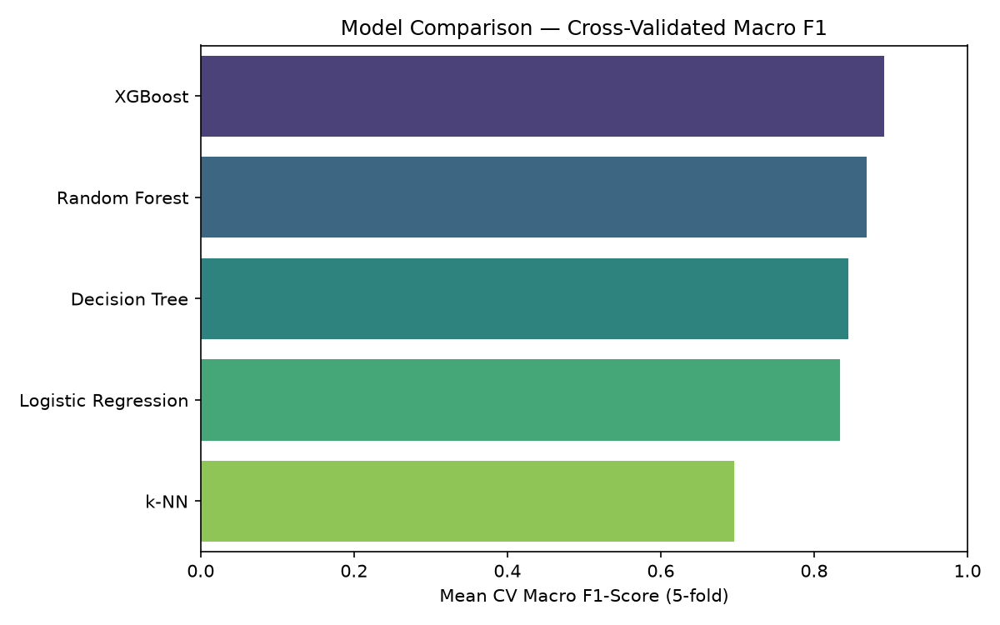
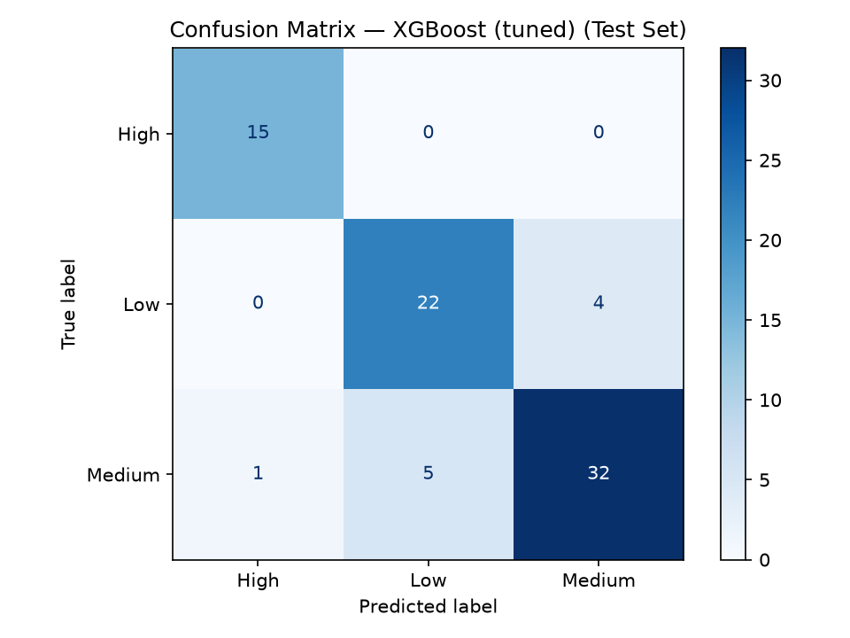
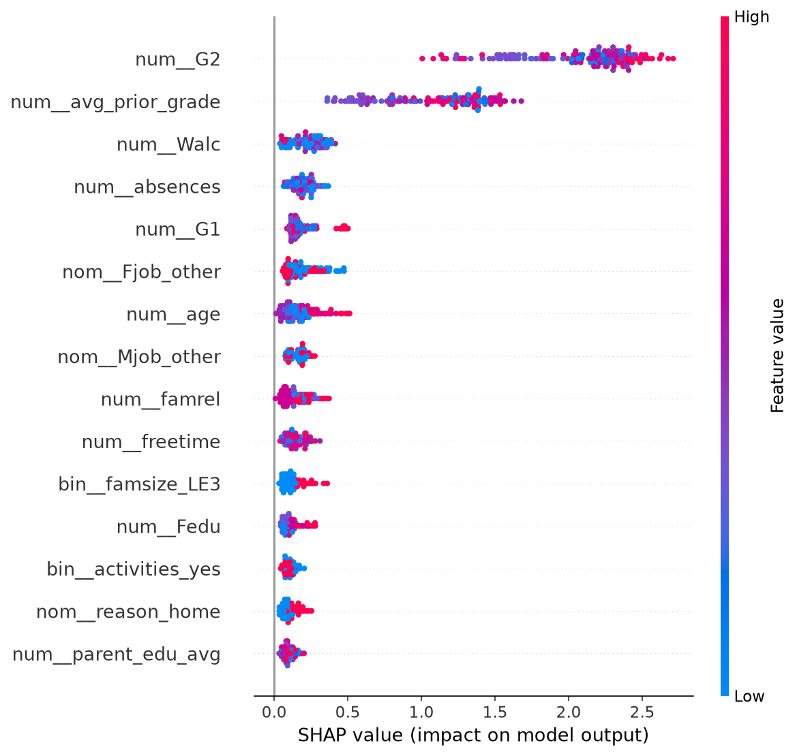

# 🎓 Student Performance Prediction

[](https://www.python.org/)
[](https://scikit-learn.org/)
[](https://xgboost.readthedocs.io/)
[](https://streamlit.io/)
[](LICENSE)

Predicts whether a student will fall into a **Low / Medium / High** final-grade band, using
demographic, academic, and behavioral data from the [UCI Student Performance dataset](https://archive.ics.uci.edu/ml/datasets/Student+Performance)
(Cortez & Silva, 2008). Built as an AI (UCS411) course project at Thapar Institute of
Engineering & Technology, then extended into a full ML pipeline with tuning, explainability,
and a live demo.

**[📄 Full report (PDF)](report/report.pdf)** · **[📓 Notebook](notebooks/eda_and_modeling.ipynb)** · 

---

## 📌 Problem Statement

Can we predict a student's academic performance category from demographic, academic, and
behavioral attributes — and how much of that accuracy depends on already knowing their prior
grades? This project answers both questions: it builds an accurate classifier **and** runs an
ablation study quantifying how much predictive power comes specifically from prior grades
(G1/G2) versus everything else (attendance, study habits, lifestyle, family background).

## 📊 Results

| Model | CV Accuracy | CV Macro F1 |
|---|---|---|
| Logistic Regression | 0.836 | 0.834 |
| Decision Tree | 0.842 | 0.844 |
| Random Forest | 0.867 | 0.869 |
| k-Nearest Neighbors | 0.706 | 0.696 |
| **XGBoost** | **0.886** | **0.892** |
| **XGBoost (tuned)** | — | **0.899** |

**Best model:** Tuned XGBoost — **87.3% test accuracy**, **0.888 macro F1** on a held-out set.

<p align="center">
  
  
</p>

### Ablation study: how much do prior grades matter?

| Feature set | Test Accuracy | Test Macro F1 |
|---|---|---|
| Random Forest — with G1/G2 | 89.9% | 0.915 |
| Random Forest — **without G1/G2** | 55.7% | 0.473 |

*(Both rows use the same Random Forest configuration so the comparison isolates the effect of
removing G1/G2, rather than mixing in a model change. The deployed model, tuned XGBoost, scores
87.3% test accuracy with all features — see Results above — but was not reused here to keep
the ablation apples-to-apples.)*

Removing prior grades drops accuracy by ~34 points — expected, but the model still clears the majority-class baseline (~49%) using only demographic, behavioral, and lifestyle data, supporting an early-warning use case before period grades exist.

### Explainability (SHAP)

<p align="center">
  
</p>

`G2` and the engineered `avg_prior_grade` dominate, followed by weekend alcohol use (`Walc`),
absences, and age — consistent with the correlation analysis and prior literature on
behavioral predictors of academic performance.

## 🚀 Demo

Run the interactive Streamlit app locally:

```bash
streamlit run app.py
```

<!-- Record a short GIF of the running app (e.g. with ScreenToGif / Kap / LICEcap) and
     embed it here for the resume-ready version of this README, e.g.:
     <p align="center"></p>
     Or deploy for free on https://streamlit.io/cloud and link the live URL here. -->

## 🗂️ Project Structure

```text
student-performance-prediction/

├── data/
│   └── student-mat.csv              # UCI Student Performance dataset (Math course, 395 students)

├── notebooks/
│   └── eda_and_modeling.ipynb       # Full EDA, modeling, tuning, SHAP walkthrough

├── src/
│   ├── preprocess.py                # Feature engineering + sklearn ColumnTransformer pipeline
│   ├── train.py                     # Trains/tunes all models, saves best pipeline + metrics
│   └── predict.py                   # Reusable inference function + CLI

├── app.py                           # Streamlit demo app

├── models/
│   ├── best_model.pkl               # Trained pipeline (preprocessing + tuned XGBoost)
│   ├── target_encoder.pkl           # Label encoder for Low/Medium/High
│   └── results.json                 # Model metrics and evaluation results

├── assets/                          # Generated plots for the README
│   ├── model_comparison.png
│   ├── confusion_matrix_best_model.png
│   └── shap_summary.png

├── report/
│   ├── figures/                     # Figures used in the LaTeX report
│   ├── report.tex                   # LaTeX source for the report
│   └── report.pdf                   # Compiled report

├── requirements.txt
├── LICENSE
└── README.md

## 🛠️ Tech Stack

- **Data & modeling:** pandas, NumPy, scikit-learn, XGBoost
- **Explainability:** SHAP
- **Visualization:** matplotlib, seaborn
- **Deployment:** Streamlit
- **Report:** LaTeX

## ⚙️ How to Run

```bash
# 1. Clone the repo
git clone https://github.com/tanvirkaur30/student-performance-prediction.git
cd student-performance-prediction

# 2. Install dependencies
pip install -r requirements.txt

# 3. Train the model (regenerates models/ and assets/)
python src/train.py

# 4. Run a single prediction from the CLI
python src/predict.py --G1 14 --G2 15 --absences 4 --studytime 2

# 5. Launch the interactive demo
streamlit run app.py

# 6. Explore the full analysis
jupyter notebook notebooks/eda_and_modeling.ipynb
```

## 🔬 Methodology

1. **Feature engineering** — `avg_alcohol`, `parent_edu_avg`, `avg_prior_grade`.
2. **Preprocessing pipeline** — `ColumnTransformer` (one-hot + scaling) inside an `sklearn.Pipeline`, avoiding data leakage across CV folds.
3. **Model comparison** — 5 algorithms compared via stratified 5-fold cross-validation (not a single train/test split).
4. **Hyperparameter tuning** — `GridSearchCV` on Random Forest and XGBoost.
5. **Ablation study** — performance with vs. without prior grades (G1/G2).
6. **Explainability** — SHAP summary plots for the final model.
7. **Deployment** — reusable inference module + Streamlit app.

See [`report/report.pdf`](report/report.pdf) for the full write-up, including literature review, discussion, and limitations.

## 📉 Limitations

- Dataset limited to 395 students from two schools in Portugal — generalizability beyond this context is untested.
- Low/Medium/High bucketing is a modeling choice; a regression formulation of the raw G3 score is a natural extension.
- Psychological/socio-emotional factors aren't in the source data and could improve predictions further.
- Any real deployment would need to address fairness and the risk of a predictive label influencing how staff treat a student.

## 📚 Dataset Citation

> P. Cortez and A. Silva. *Using Data Mining to Predict Secondary School Student Performance.*
> In A. Brito and J. Teixeira Eds., Proceedings of 5th FUture BUsiness TEChnology Conference
> (FUBUTEC 2008) pp. 5-12, Porto, Portugal, April 2008, EUROSIS.

## 👥 Authors

- Tanvir Kaur (102303389)
Thapar Institute of Engineering & Technology, Patiala — 

## 📄 License

This project is licensed under the MIT License — see [LICENSE](LICENSE) for details.